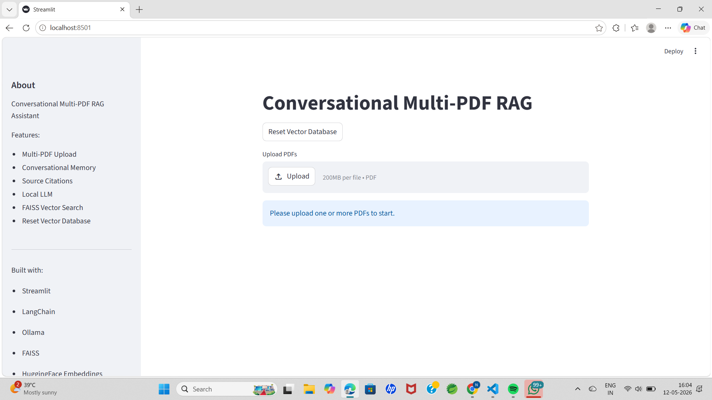
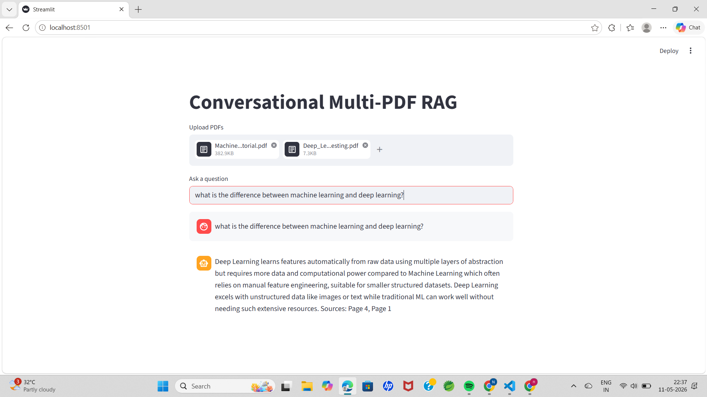
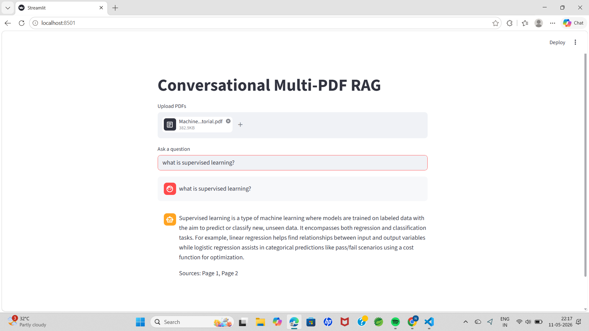

# Conversational Multi-PDF Self-Healing RAG Assistant

A conversational Retrieval-Augmented Generation (RAG) application built using Streamlit, LangChain, FAISS, Ollama, and HuggingFace embeddings.

## Features

- Multi-PDF Upload
- Conversational Memory
- Source Citations
- Local LLM using Ollama
- FAISS Vector Database
- Hallucination Reduction
- Chat-style Interface
- Persistent Local Vector Database
- Reset Vector Database Feature

## Tech Stack

- Python
- Streamlit
- LangChain
- FAISS
- Ollama
- HuggingFace Embeddings

## Project Workflow

1. Upload PDFs
2. Extract text from PDFs
3. Split text into chunks
4. Generate embeddings
5. Store embeddings in FAISS
6. Retrieve relevant context
7. Generate grounded responses using Local LLM
8. Maintain conversational memory

## Installation

### Clone Repository

```bash
git clone <your-repository-url>
```

### Install Dependencies

```bash
pip install -r requirements.txt
```

### Run Ollama

```bash
ollama run phi3
```

### Start Application

```bash
streamlit run chat_pdf_rag.py
```

## Example Questions

- What is machine learning?
- Explain reinforcement learning.
- Difference between machine learning and deep learning.
- Summarize the uploaded PDFs.

## Future Improvements

- Public deployment
- OCR/Image support
- Streaming responses
- Authentication
- Hybrid Search
- Voice Assistant Integration

## Screenshots

### Home Page



### Multi-PDF Upload



### Chat Response



## Author

Niveditha Nagisetti